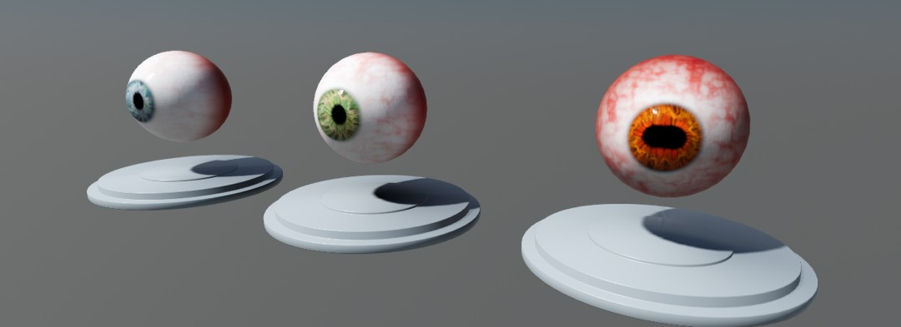

# Digital Humans for Godot Engine

This project aims at providing shaders and materials for creating realistic
looking characters in games made with Godot Engine 4. It can serve as a learning
resource, but it is equally suited to be used directly in games.

The project is licensed under the MIT license, all art assets are CC0 except
where noted differently in the [Credits](#credits) section.

## What's in the Box?

- [An eye shader & model](#eye-shader) with iris refraction and tons of configurable parameters
- [A skin shader](#skin-shader) with lots of customizable elements, including make-up and a wrinkle system

## Eye Shader

Eye shaders in the past often required the models to have the iris cavity modeled
out and used multiple materials to create the effect of depth and refraction. This
shader works on a single mesh, refraction and depth are created entirely in the
shader and can be controlled by shader parameters.

For this setup to work, the mesh should be unwrapped in a certain way. The front
half of the mesh should be projected onto the UV plane with the center of the iris
in the center of the plane. The back half of the eye can be projected the same way
or be scaled down and pushed into one of the corners, it doesn't really matter.
"Up" in UV space should match "Up" in model space.

The project contains an eye model that can be exported, studied, and used any way
you like.

Features of this shader include:

- [X] Iris refraction and depth
- [X] Configurable iris colors
- [X] A set of textures for various iris patterns
- [X] Configurable limbus width and darkness
- [X] Pupil diameter, width and height are separately configurable
- [X] Parallax occlusion mapping
- [X] Subsurface scattering
- [ ] Iris caustics

## Skin Shader

The skin shader uses a number of different textures to achieve a realistic look.
The single most important part in getting characters to look lifelike is the quality
of these textures. They are **Albedo**, **Normal**, **Roughness**, **Specular**,
**Subsurface** and **Transmission**.

The albedo and normal textures serve the same purpose as for any other 3D model
and provide color and surface detail information. The normal map can easily end up
being too harsh and its strength can be controlled with a shader parameter.

The roughness texture is pure black, which is probably surprising. The skin's roughness
is calculated from the normal map and added to the roughness texture on import.
This has several advantages, the main one being that the roughness changes along with
the normals when using several normal maps for animating wrinkles in the face. The
base roughness can be controlled with shader parameters, but it is possible to use
a regular, artist-created roughness map as a base.

The specular map controls the strength of specular highlights across the face and
body. Specular highlights are stronger in places where skin is stretched tight.
On the other hand, there should not be any inside pores or wrinkles. This is what
this map achieves.

The subsurface and transmission textures control the strength of subsurface scattering
across the skin. SSS is especially strong around the eyes, ears, nose and lips.
The transmission texture controls how much light shines through a part of the body
when it is lit from behind. This is typically strongest in the ears and the nose,
as well as any other spot where skin is very thin.

The tattoo layer reacts to subsurface scattering and provides parameters to age,
tint and fade the tattoo. The make-up layer ignores subsurface scattering since it
is painted on top of the skin in real life. It provides the full set of normal and
PBR texture masks so that even intricate make-up and face paint patterns are possible.

Features of this shader include:

- [X] Adjustable skin tone
- [X] Subsurface scattering
- [X] Light transmission
- [X] Tattoos
- [X] Make-up
- [ ] Animatable wrinkles

## Credits

This repository doesn't use any third-party assets at the time of writing.
